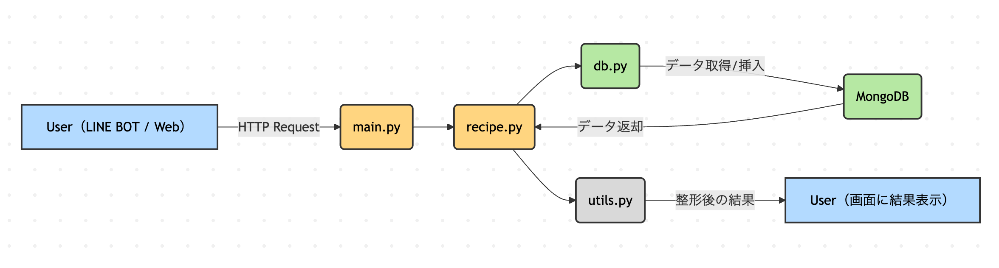

# ミステリーレシピ バックエンド

このプロジェクトは **「ミステリーレシピ」** システムのバックエンドAPIです。  
ユーザーが食材や調理時間を入力すると、それに合ったレシピを提案し、1ステップずつ表示する機能を提供しています。

## 使用技術

- **FastAPI**：Python製の軽量なWeb APIフレームワーク
- **MongoDB**：NoSQL データベース
- **Python**: 3.10.13

## アーキテクチャ



## 各ファイルの役割

- **main.py**  
  FastAPI アプリケーションを起動するファイル。`uvicorn main:app` でサーバーを立ち上げます。

- **recipe.py**  
  ユーザーからのリクエスト（食材・調理時間）を受け取り、レシピを1ステップずつ返すAPIエンドポイントを定義します。

- **db.py**  
  MongoDBとのデータ操作（レシピの挿入・検索）を行います。  
  API内部で呼び出され、データ取得に使用します。

- **models.py**  
  Pydantic を使ったデータモデル定義用のファイル。  
  現在はまだ使っていませんが、将来的に API の入力・出力形式を明確に定義する際に使用予定です。

- **utils.py**  
  プロジェクト全体で使う補助的な関数（文字列整形など）をまとめて記述します。  
  現在は主なロジックはまだ recipe.py と db.py に集中しています。

## 起動方法

1️⃣ 必要なライブラリをインストール：

```bash
pip install -r requirements.txt
```

2️⃣ サーバーを起動：
```bash
uvicorn main:app --reload
```

3️⃣ API確認：
ブラウザで以下のURLにアクセスすると Swagger UI が確認できます：
```bash
http://127.0.0.1:8000/docs
```

## 今後の改良案
- models.py を活用して API の Request/Response モデルを統一する

