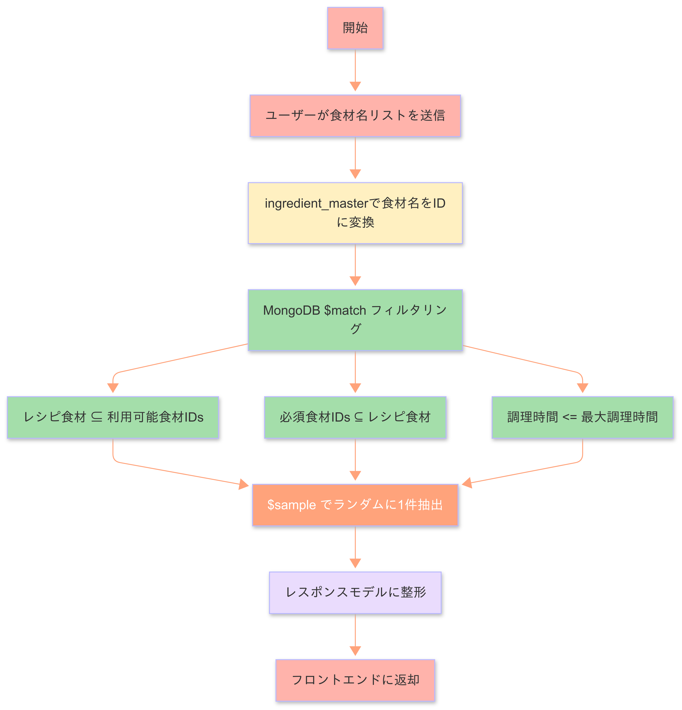

## 📊 処理フロー概要（推薦APIの内部処理）



### 1️⃣ クライアントから推薦リクエスト送信

エンドポイント:
**POST /recipes/recommend**

リクエスト内容（例）:

```json
{
  "available_ingredients": ["キャベツ", "じゃがいも", ...],
  "required_ingredients": ["鶏肉"],
  "max_cooking_time": 30
}
```

* `available_ingredients` … 現在冷蔵庫にある食材リスト
* `required_ingredients` … 絶対に使いたい食材リスト
* `max_cooking_time` … 希望する調理時間（分）

---

### 2️⃣ APIサーバーでルーターがリクエストを受信

FastAPI の router 層がリクエストデータを受け取り、推薦ロジックへ渡す。

---

### 3️⃣ 名前 ➔ 食材ID 変換処理

* `ingredient_master` コレクションを検索
* `standard_name` と `synonyms` にマッチする食材ID（`ingredient_id`）を抽出
* ユーザー入力された食材名 ➔ DB内部の食材IDに変換する

---

### 4️⃣ MongoDB Aggregation によるレシピ絞り込み & ランダム抽出

* `recipes` コレクションに対して以下の条件でフィルター

#### フィルター条件：

* 使用食材が `available_ids` 内に完全一致する
* `required_ids` のすべてを含んでいる
* 調理時間が `max_cooking_time` 以下である

#### さらに：

* `$sample` ステージを利用し、条件に合致したレシピの中から**ランダムに1件**抽出

---

### 5️⃣ MongoDBから取得したレシピデータを整形

* MongoDB の `_id`（ObjectId型）を文字列に変換
* Pydantic モデルにマッピングして整形

---

### 6️⃣ レスポンス生成

最終的なAPIレスポンス例：

```json
{
  "name": "...",
  "ingredients": [...],
  "steps": [...],
  "missing_ingredients": [],
  "recommend_score": 1.0,
  "recommend_reason": "おすすめのレシピを見つけました！"
}
```
---

### 7️⃣ フィルタリング処理の具体例

**ユーザーの入力条件:**

- 利用可能食材（available_ingredients）: 
  ["キャベツ", "じゃがいも", "にんじん", "鶏肉"]
- 必須食材（required_ingredients）: 
  ["鶏肉"]
- 最大調理時間（max_cooking_time）: 30分


**これらの食材名は全て `ingredient_master` から `ingredient_id` に変換済みとします:**

* available\_ids:

```json
["A", "B", "C", "D"]
```

（例：A = キャベツ、B = じゃがいも、C = にんじん、D = 鶏肉）

* required\_ids:

```json
["D"]
```

**データベース内の3つのレシピ:**

**レシピ1: 野菜スープ**
- ingredients.ingredient_id = ["A", "B", "C"]
- cooking_time = 20分

**レシピ2: 鶏肉シチュー**
- ingredients.ingredient_id = ["A", "B", "D"]
- cooking_time = 25分

**レシピ3: ビーフカレー**
- ingredients.ingredient_id = ["A", "E", "F"]
- cooking_time = 35分

**フィルタリング条件ごとの判定:**

| レシピ | $setIsSubset (食材全て冷蔵庫にあるか) | 必須食材含有 | 調理時間 | 結果 |
| --- | --- | --- | --- | --- |
| 野菜スープ | ✅ | ❌ | ✅ | ❌ |
| 鶏肉シチュー | ✅ | ✅ | ✅ | ✅ |
| ビーフカレー | ❌ | ❌ | ❌ | ❌ |

---

**最終的に推薦候補となるレシピは「鶏肉シチュー」のみ。**

その後 `$sample` により、（候補が複数ある場合は）ランダムで1件抽出されます。

## 🚀 今後の改善ポイント: 食材データベースの自動拡張

現在のシステムでは、食材名の入力時に事前に用意した食材辞書（synonym list）を利用して、標準化処理（正規化）を行っています。しかし、今後さらに以下のような 動的辞書エンジン の導入を検討しています：

🔍 リアルタイム辞書検索
ユーザー入力に対してサーバー側で都度、辞書DB（ingredient_master）を検索し、より柔軟なマッチングを実現します。

🧠 AI補完（GPT連携）
辞書に登録されていない新しい食材名や表記揺れにも対応できるよう、AIによる自動分類・推定を組み合わせます。

📈 辞書の自己進化
AI推定結果や管理者レビューによって辞書データを継続的に拡張・学習させ、使うほど賢くなるシステムを目指します。

この仕組みによって、ユーザーの自由入力に対して柔軟かつ高精度な食材認識が可能となり、より使いやすいレシピ推薦体験を提供できると考えています。

